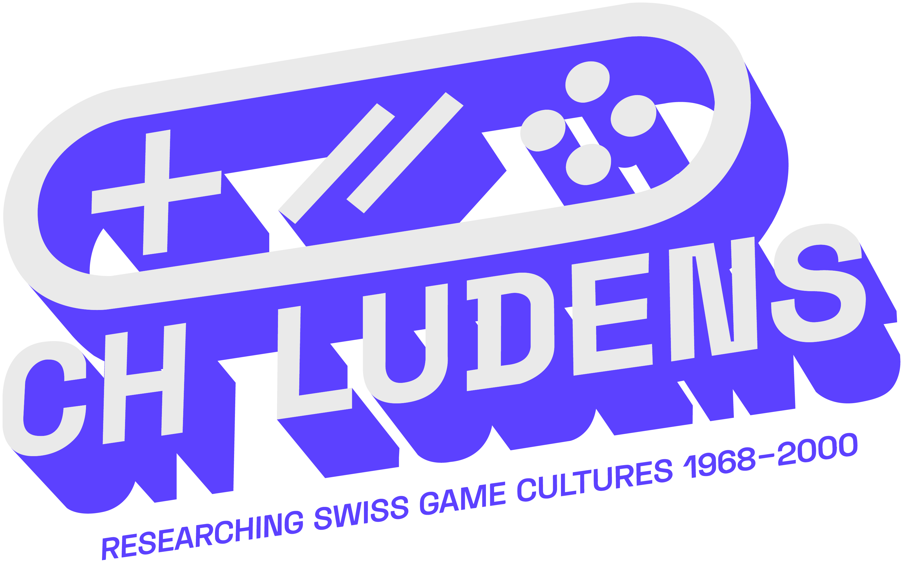
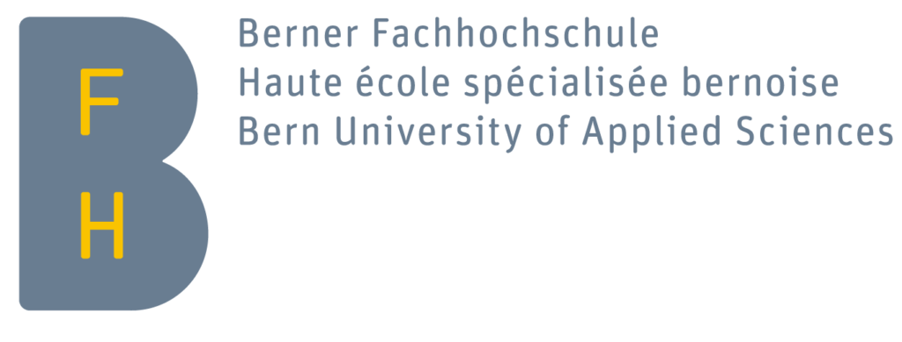

# Let’s play!

Videospiele sind kein neues Phänomen mehr. Sie blicken in der Schweiz auf eine Geschichte von mehr als 50 Jahren zurück und schon unsere Grosseltern haben in den 1970er und 1980er-Jahren die ersten Games gespielt! Heute sind Videospiele aus unserem Alltag nicht mehr wegzudenken. Trotz der wichtigen Rolle, die Gaming in unserer Gesellschaft spielt, sind wir es aber nicht gewohnt generationsübergreifend über dieses Thema zu sprechen. Wie teilen wir unsere Erlebnisse und diskutieren über Videospiele in der Familie oder in Schulklassen?

Les jeux vidéo ne sont plus un phénomène nouveau. Ils ont plus de 50 ans d'histoire en Suisse et nos grands-parents ont déjà joué aux premiers jeux dans les années 1970 et 1980! Aujourd'hui, les jeux vidéo font partie de notre quotidien. Malgré le rôle important que jouent les jeux vidéo dans notre société, nous n'avons pas l'habitude d'en parler à travers les générations. Comment partageons-nous nos expériences et discutons-nous des jeux vidéo en famille ou à l'école?

## Poster Texte / Poster textes

- [Einführung / Introduction](texts/0%20Intro.md)
- [1. Flipperkästen - Boîtes à flipper](texts/1%20Flipperkästen%20-%20Boîtes%20à%20flipper.md)
- [2. Arcade-Hallen - Salles d'arcade](texts/2%20Arcade-Hallen%20-%20Salles%20d'arcade.md)
- [3. Mikrocomputer - Micro-ordinateurs](texts/3%20Mikrocomputer%20-%20Micro-ordinateurs.md)
- [4. Weihnachten - Noël](texts/4%20Weihnachten%20-%20Noël.md)
- [5. Geschwister - Frères et sœurs](texts/5%20Geschwister%20-%20Frères%20et%20sœurs.md)

## Print

- [Poster](assets/print/Poster_Exhibition.pdf)
- [Gaming Corner Information](assets/print/Gaming_Corner_Information.pdf)

## [Impressum](_pages/Impressum.md)

Diese Texte begleiten die Ausstellung "[Let’s play! Videospielkultur in der Schweiz](https://www.bfh.ch/gesundheit/de/aktuell/fachveranstaltungen/digital-days-nov-2024-lets-play/)". Ces textes accompagnent l'exposition "[Let's play ! La culture du jeu vidéo en Suisse](https://www.bfh.ch/sante/fr/actualites/evenements-pour-specialistes/digital-days-nov-2024-lets-play/)". Diese Ausstellung wurde organisiert von [Confoederatio Ludens](https://chludens.ch) im Rahmen der BFH Digitaltage 2024 in Zusammenarbeit mit der Stadtbibliothek Biel/Bienne und realisiert durch / Cette exposition a été organisée par [Confoederatio Ludens](https://chludens.ch) dans le cadre des Journées numériques HESB 2024 en collaboration avec la Bibliothèque de la ville de Biel/Bienne et réalisée par Adrian Demleitner, Loïse Bilat, Eugen Pfister, Sara Plutino, et Sarah Rochat.

Mit freundlicher Unterstützung der [ENTER Technikwelt Solothurn](https://www.enter.ch). *Avec l'aimable soutien de [ENTER Technikwelt Solothurn](https://www.enter.ch).*

Kontaktieren Sie uns unter / Contactez-nous à l'adresse info@chludens.ch.

{: width="100px"}
{: width="100px"}
{: width="100px"}
{: width="100px"}
{: width="100px"}

## Lizenz / Licence
Dieses Werk steht unter einer / Ce travail est sous licence 
[Creative Commons Attribution 4.0 International License][cc-by].

[![CC BY 4.0][cc-by-image]][cc-by]

[cc-by]: http://creativecommons.org/licenses/by/4.0/
[cc-by-image]: https://i.creativecommons.org/l/by/4.0/88x31.png
